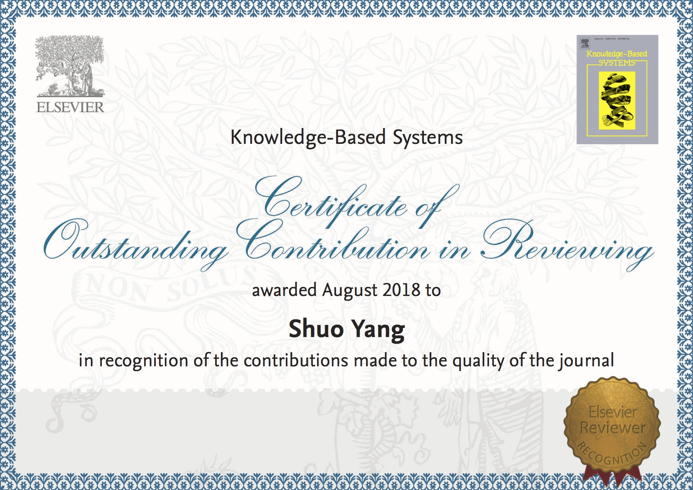

+++

# Tag Cloud widget.
widget = "blank"  # Do not modify this line!
active = true  # Activate this widget? true/false

title = "Services"
subtitle = ""

# Order that this section will appear in.
weight = 120
+++
PC member of IJCAI 2019  
PC member of IJCAI 2018  
reviewer for Journal Knowledge-Based Systems <a href="#section1">[1]</a>  [^1]  
reviewer for Journal of Artificial Intelligence Research  
reviewer for NIPS 2016  
subreviewer for LOD 2018,  AAAI 2016, AISTATS 2016, UAI 2015, ICDM 2015, KDD 2014  

[1] reviewer with outstanding contribution awarded by Knowledge-Based Systems, 2018. 

[^1]: reviewer with outstanding contribution awarded by Knowledge-Based Systems, 2018. 

 
