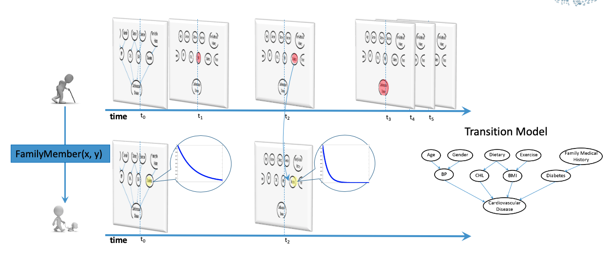

+++
# widget = "Portfolio"  # Do not modify this line!
# active = true  # Activate this widget? true/false
# weight = 15  # Order that this section will appear.

# Note: a full width section format can be enabled by commenting out the `title` and `subtitle` with a `#`.
title = "Sequence Data Mining"
subtitle = "Relational Continuous Time Bayesian Network"
  
# Project title.
# title = "Sequence Data Mining"

# Date this page was created.
date = 2019-03-13T00:00:00

# Project summary to display on homepage.
summary = "In most realistic domains, the variables transit between its possible states over time. The data is generated by the dynamic processes with multiple observations at different time points. Dynamic models are needed for modeling such transition intensities over time."
# Tags: can be used for filtering projects.
# Example: `tags = ["machine-learning", "deep-learning"]`
tags = ["machine-learning", "dynamic-model", "statistical-relational-learning", "continuous-time-trajectory", "sequential-events-prediction"]

# Optional external URL for project (replaces project detail page).
#external_link = ""

# Slides (optional).
#   Associate this project with Markdown slides.
#   Simply enter your slide deck's filename without extension.
#   E.g. `slides = "example-slides"` references 
#   `content/slides/example-slides.md`.
#   Otherwise, set `slides = ""`.
#slides = "example-slides"

# Links (optional).
url_pdf = "https://shuoyang.netlify.com/publication/yang-kkn-16/"
#url_slides = ""
#url_video = ""
url_code = "https://shuoyang.netlify.app/project/sdm/"

# Custom links (optional).
#   Uncomment line below to enable. For multiple links, use the form `[{...}, {...}, {...}]`.
# url_custom = [{icon_pack = "fab", icon="twitter", name="Follow", url = "https://twitter.com/georgecushen"}]

# Featured image
# To use, add an image named `featured.jpg/png` to your project's folder. 
[image]
  # Caption (optional)
  #caption = ""
  
  # Focal point (optional)
  # Options: Smart, Center, TopLeft, Top, TopRight, Left, Right, BottomLeft, Bottom, BottomRight
  focal_point = "Right"
+++
In this project, we consider the problem of predicting sequential events by learning from variable trajectories with dinstinct temporal resolutions. Most of the real-world events occur at their distinct paces, some events happen more frequently than others. However, for most of the dynamic models such as HMM, DBNs, or RNN, they model such dynamic process with constant interval between the time slices. So, in order to avoid missing any events along the trajectories, they need to model the system at the shortest possible interval. This leads to the increased computational cost when performing inference over time. 
Continuous Time Bayesian Networks (CTBN), on the other hand, models the time directly by assuming the probability for certain event to happen is an exponential function of time. So it can answer queries at any time point.

Moreover, relations are widely existing among the trajectories of features from different objects. Take the following network as an example. The chance of getting type 2 diabetes increases with age, so its transition probability can be modeled with an exponential function of time. 
it is also a hereditary disease, so the transition likelihood of a person’s diabetes status depends on the trajectory of his family members’ diabetes status. If a family member of the target object has been diagnosis with diabetes at time 2, then our belief in the transition probability of this individual’s diabetes status would have larger transition parameter from this time point on. And the solution for the structured data is the statistical relational models.

<h1>How to use this package?</h1>

<h2>  The whole package can be downloaded <a href="RCTBNPackage.zip"> <u>here.</u></a>  </h2>
		
 The package includes a sample data set generated from the drug effect networks in <a href="https://www.cs.ucr.edu/~cshelton/papers/docs/ctbn.pdf"> <u>Nodelman's CTBN paper</u></a>, the RFGB code for learning RCTBNs and the code for calculating the metrics of evaluating the performance of learning algorithms. 

More details about the algorithm can be found in <a href="https://shuoyang.netlify.app/publication/yang-kkn-16/"> <u>[Yang et al. 2016].</u></a> Please use the following citation to acknowledge the contribution made by this package to your research. [^1]

[^1]: Shuo Yang, Tushar Khot, Kristian Kersting and Sriraam Natarajan, Learning Continuous-Time Bayesian Networks in Relational Domains: A Non-Parametric Approach, Proceedings of the Thirtieth AAAI Conference on Artificial Intelligence, AAAI 2016.
